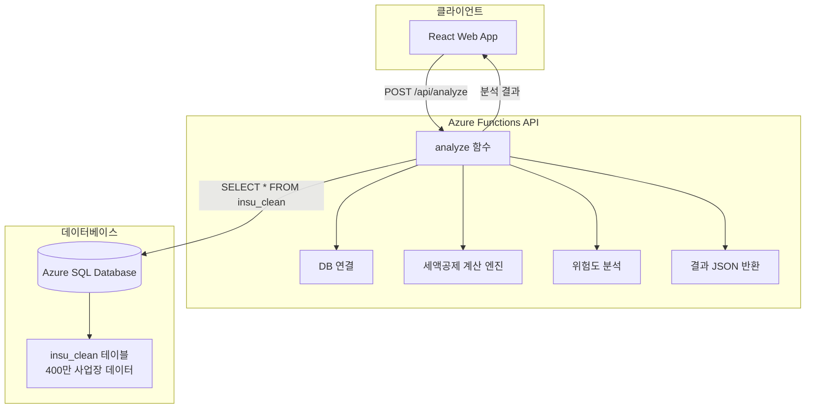

# 🚀 taxcredit-api-func

**세액공제 분석용 Azure Functions API - 서버 중앙집중식 계산 엔진**

400만 사업장 DB를 기반으로 고용증대세액공제 및 사회보험료세액공제를 종합 분석하여  
**3단계 분류 시스템**(💚즉시신청/⚠️신중검토/❌신청불가)으로 결과를 제공하는 REST API입니다.

[](https://azure.microsoft.com/services/functions/)
[](https://nodejs.org/)
[](https://restfulapi.net/)

---

## 📋 목차

1. [API 개요](#-api-개요)
2. [아키텍처](#-아키텍처)
3. [엔드포인트](#-엔드포인트)
4. [세액공제 분석 로직](#-세액공제-분석-로직)
5. [배포 가이드](#-배포-가이드)
6. [개발 가이드](#-개발-가이드)
7. [모니터링](#-모니터링)
8. [트러블슈팅](#-트러블슈팅)

---

## 🎯 API 개요

### **핵심 기능**
- **실시간 DB 조회**: Azure SQL Database insu_clean 테이블 전체 컬럼 조회
- **세액공제 계산**: 고용증대세액공제 + 사회보험료세액공제 동시 계산
- **3단계 분류**: 경정청구 기간, 사후관리 기간 기반 위험도 자동 분류
- **실시간 조정**: 청년 비율, 사회보험료 배수 실시간 반영

### **검증 기준**
- **한헬스케어** (사업자번호: 1010120403): 총 **3억 2,200만원** 세액공제 가능

### **v3.0 주요 변화**
```diff
+ ✅ 클라이언트 계산 로직 완전 이관 (380줄 → 200줄 서버 통합)
+ ✅ 보안성 강화 (핵심 로직 서버 보호)
+ ✅ 일관성 확보 (중앙집중식 계산)
+ ✅ 유지보수성 향상 (API만 업데이트하면 즉시 반영)
```

---

## 🏗️ 아키텍처

### **시스템 구조**


### **디렉토리 구조**
```
taxcredit-api-func/
├── analyze/
│   ├── index.js                 # 메인 API 함수 + 세액공제 로직 (200줄)
│   └── function.json            # Azure Functions 설정
├── utils/
│   ├── db-utils.js              # DB 연결 유틸리티
│   └── ai-analysis.js           # AI 분석 모듈 (선택적)
├── package.json                 # 의존성 관리
├── host.json                    # Functions 호스트 설정
├── local.settings.json.example  # 로컬 개발 환경 설정 예시
└── README.md                    # 이 문서
```

---

## 🔗 엔드포인트

### **analyze 함수**

#### **URL**
```
POST https://taxcredit-api-func.azurewebsites.net/api/analyze
```

#### **요청 헤더**
```http
Content-Type: application/json
```

#### **요청 본문**
```json
{
  "bizno": "1234567890",           // 필수: 사업자등록번호 (10자리)
  "youthRatio": 0.0,               // 선택: 청년 비율 (0.0~1.0, 기본값: 0.0)
  "socialInsuranceRate": 1.0       // 선택: 사회보험료 배수 (0.5~3.0, 기본값: 1.0)
}
```

#### **성공 응답 (200)**
```json
{
  "success": true,
  "bizno": "1234567890",
  "mode": "full-analysis",
  "queryInfo": {
    "table": "insu_clean",
    "executionTime": "250ms",
    "timestamp": "2025-01-06T10:30:00.000Z"
  },
  "data": {
    // 원본 DB 데이터 (insu_clean 테이블 전체 컬럼)
    "사업자등록번호": "1234567890",
    "사업장명": "한헬스케어",
    "시도": "경기도",
    "구군": "안산시",
    "업종명": "기관구내식당업",
    "2016": 0, "2017": 0, "2018": 0, "2019": 0, "2020": 0,
    "2021": 50, "2022": 60, "2023": 70, "2024": 80, "2025": 0,
    "제외여부": "(직권)분식"
  },
  "analysisResult": {
    "results": [
      {
        "year": "2022",
        "increaseCount": 10,
        "employmentCredit": 70000000,
        "socialInsuranceCredit": 5000000,
        "totalCredit": 75000000,
        "status": "사후관리종료",
        "classification": {
          "key": "IMMEDIATE_APPLICATION",
          "icon": "💚",
          "title": "즉시신청"
        },
        "amendmentDeadline": "2028-03-31",
        "managementEndDate": "2024-12-31",
        "riskAnalysis": {
          "amendment": { "isEligible": true, "remainingDays": 1200 },
          "postManagement": {
            "employment": { "isInManagementPeriod": false, "status": "사후관리완료" },
            "socialInsurance": { "isInManagementPeriod": false, "status": "사후관리완료" }
          }
        },
        "duplicateRule": {
          "isDuplicateAllowed": true,
          "reason": "고용증대세액공제와 사회보험료세액공제 중복 적용 가능"
        }
      }
    ],
    "summary": {
      "기간경과미신청": 0,
      "사후관리종료": 322000000,    // 3억 2,200만원
      "사후관리진행중": 0,
      "총계": 322000000
    },
    "companyInfo": {
      "bizno": "1234567890",
      "companyName": "한헬스케어",
      "companyType": "중소기업",
      "region": "수도권외",
      "industry": "일반업종",
      "sido": "경기도",
      "gugun": "안산시"
    }
  }
}
```

#### **실패 응답 (404)**
```json
{
  "success": false,
  "bizno": "1234567890",
  "error": "사업자등록번호 1234567890에 대한 데이터가 없습니다."
}
```

#### **오류 응답 (400, 500)**
```json
{
  "success": false,
  "bizno": "unknown",
  "error": "Missing bizno parameter",
  "timestamp": "2025-01-06T10:30:00.000Z"
}
```

---

## 🧮 세액공제 분석 로직

### **통합된 계산 모듈들**

#### **1. 지역/업종 분류**
```javascript
// 🗺️ 지역 분류 (수도권 여부)
const classifyRegion = (sido) => {
  const 수도권지역 = ["서울특별시", "경기도", "인천광역시"];
  return 수도권지역.some(area => sido?.includes(area)) ? "수도권" : "수도권외";
};

// 🏭 업종 분류 (신성장서비스업 여부)  
const classifyIndustry = (industryCode) => {
  const 신성장업종코드 = ["62", "63", "72"]; // IT, 연구개발, 전문서비스
  return 신성장업종코드.includes(industryCode?.substring(0,2) || "") ? "신성장서비스업" : "일반업종";
};
```

#### **2. 기간 검증**
```javascript
// 📅 경정청구 기간 확인 (5년 기준)
const checkAmendmentEligibility = (targetYear, currentDate = new Date()) => {
  const amendmentDeadline = new Date(parseInt(targetYear) + 6, 2, 31); // 5년 후 3월 31일
  const isEligible = currentDate <= amendmentDeadline;
  return { isEligible, amendmentDeadline, status: isEligible ? "경정청구가능" : "기간만료" };
};

// 🛡️ 사후관리 기간 확인 (고용증대 2년, 사회보험료 1년)
const checkPostManagementPeriod = (targetYear, creditType = "고용증대세액공제") => {
  const managementPeriods = { "고용증대세액공제": 2, "사회보험료세액공제": 1 };
  // ... 계산 로직
};
```

#### **3. 위험도 분석**
```javascript
// 🎯 3단계 위험도 상태 결정
const determineRiskStatus = (targetYear, currentDate = new Date()) => {
  const amendment = checkAmendmentEligibility(targetYear, currentDate);
  const postMgmtEmployment = checkPostManagementPeriod(targetYear, "고용증대세액공제");
  const postMgmtSocial = checkPostManagementPeriod(targetYear, "사회보험료세액공제");
  
  if (!amendment.isEligible) {
    return { status: '기간경과미신청', classification: '❌ 신청불가' };
  } else if (!postMgmtEmployment.isInManagementPeriod && !postMgmtSocial.isInManagementPeriod) {
    return { status: '사후관리종료', classification: '💚 즉시신청' };
  } else {
    return { status: '사후관리진행중', classification: '⚠️ 신중검토' };
  }
};
```

#### **4. 세액공제 계산**
```javascript
// 💰 고용증대세액공제 계산
const calculateEmploymentCredit = (increaseCount, targetYear, region, youthRatio = 0) => {
  const EMPLOYMENT_CREDIT_RATES = {
    "2020": { "수도권": 700, "수도권외": 770 },
    "2021": { "수도권": 700, "수도권외": 770 },
    "2022": { "수도권": 700, "수도권외": 770 },
    "2023": { "수도권": 700, "수도권외": 770 },
    "2024": { "수도권": 700, "수도권외": 770 }
  };
  
  const YOUTH_MULTIPLIER = { "수도권": 1.57, "수도권외": 1.56 };
  // ... 계산 로직
};

// 🛡️ 사회보험료세액공제 계산  
const calculateSocialInsuranceCredit = (increaseCount, industry, youthRatio = 0, socialInsuranceRate = 1.0) => {
  const SOCIAL_INSURANCE_RATES = {
    "청년외_일반": 0.5,     // 50%
    "청년외_신성장": 0.75,  // 75% (신성장서비스업)
    "청년등_배수": 2.0      // 청년등은 100%이므로 50%의 2배
  };
  // ... 계산 로직
};
```

### **5. 메인 분석 함수**
```javascript
// 📊 핵심: 세액공제 분석 실행 (메인 함수)
const analyzeCompanyTaxCredit = (companyInfo, youthRatio = 0, socialInsuranceRate = 1.0) => {
  // 1. DB 데이터 변환
  const { companyInfo: convertedCompanyInfo, employeeData } = convertDbDataToCalculationFormat(companyInfo);
  
  // 2. 연도별 증감 계산
  const employeeChanges = calculateYearlyChanges(employeeData);
  
  // 3. 2017년부터 2024년까지 분석
  for (let year = 2017; year <= 2024; year++) {
    const riskAnalysis = determineRiskStatus(yearStr, currentDate);
    const duplicateRule = checkDuplicateEligibility(yearStr);
    
    if (riskAnalysis.amendment.isEligible) {
      const employmentCredit = calculateEmploymentCredit(/* 파라미터 */);
      const socialInsuranceCredit = calculateSocialInsuranceCredit(/* 파라미터 */);
    }
  }
  
  // 4. 요약 데이터 계산
  return { results, summary, companyInfo: convertedCompanyInfo };
};
```

---

## 🚀 배포 가이드

### **사전 요구사항**
```bash
# Azure Functions Core Tools 설치
npm install -g azure-functions-core-tools@4

# Azure CLI 설치 및 로그인
az login
```

### **로컬 개발 환경 설정**
```bash
# 프로젝트 클론
git clone https://github.com/your-repo/taxcredit-api-func
cd taxcredit-api-func

# 의존성 설치
npm install

# 환경 설정
cp local.settings.json.example local.settings.json
# local.settings.json에서 DB 연결 문자열 설정

# 로컬 실행
func start
```

### **Azure 배포**
```bash
# Azure Functions에 배포
func azure functionapp publish taxcredit-api-func

# 배포 확인
curl https://taxcredit-api-func.azurewebsites.net/api/analyze \
  -X POST \
  -H "Content-Type: application/json" \
  -d '{"bizno":"1010120403"}'
```

### **환경 변수 설정**
```bash
# Azure Portal 또는 CLI로 환경 변수 설정
az functionapp config appsettings set \
  --name taxcredit-api-func \
  --resource-group rg-taxcredit \
  --settings \
    DB_CONNECTION_STRING="Server=tcp:..." \
    WEBSITE_NODE_DEFAULT_VERSION="~18"
```

---

## 🛠️ 개발 가이드

### **로컬 개발**
```bash
# 개발 서버 실행 (포트 7071)
func start

# 다른 터미널에서 테스트
curl http://localhost:7071/api/analyze \
  -X POST \
  -H "Content-Type: application/json" \
  -d '{"bizno":"1234567890","youthRatio":0.0,"socialInsuranceRate":1.0}'
```

### **디버깅**
```javascript
// index.js에서 디버깅 로그 활용
context.log('🔍 요청 파라미터:', { bizno, youthRatio, socialInsuranceRate });
context.log('📊 DB 쿼리 결과:', result.recordset.length);
context.log('💰 분석 결과 총계:', analysisResult.summary.총계.toLocaleString());
```

### **새로운 분석 로직 추가**
```javascript
// 새로운 계산 함수 추가 시
const calculateNewCredit = (params) => {
  // 새로운 세액공제 계산 로직
  return calculatedAmount;
};

// 메인 분석 함수에 통합
const analyzeCompanyTaxCredit = (companyInfo, options) => {
  // 기존 로직...
  
  // 새로운 계산 추가
  const newCredit = calculateNewCredit(params);
  
  return { 
    results: [..., { newCredit }], 
    summary: { 총계: totalCredit + newCredit }
  };
};
```

### **성능 최적화**
```javascript
// DB 쿼리 최적화
const query = `
  SELECT TOP 1 * FROM insu_clean 
  WHERE 사업자등록번호 = @bizno
  WITH (NOLOCK)  -- 읽기 전용 성능 향상
`;

// 계산 결과 캐싱 (선택적)
const cacheKey = `analysis_${bizno}_${youthRatio}_${socialInsuranceRate}`;
// Redis 또는 메모리 캐시 활용 고려
```

---

## 📊 모니터링

### **Application Insights 설정**
```javascript
// package.json에 추가
{
  "dependencies": {
    "applicationinsights": "^2.x"
  }
}

// index.js에서 초기화
const appInsights = require('applicationinsights');
appInsights.setup().start();
```

### **주요 메트릭**
- **응답 시간**: 목표 250ms 이하
- **성공률**: 목표 99.9% 이상  
- **DB 연결 시간**: 목표 50ms 이하
- **메모리 사용량**: 512MB 이하

### **로그 모니터링**
```bash
# Azure CLI로 실시간 로그 확인
func azure functionapp logstream taxcredit-api-func

# 또는 Azure Portal > Function App > Log stream
```

### **알림 설정**
- **오류율 > 1%**: 즉시 알림
- **응답시간 > 500ms**: 경고 알림  
- **DB 연결 실패**: 즉시 알림

---

## 🚨 트러블슈팅

### **자주 발생하는 문제들**

#### **1. DB 연결 오류**
```
❌ 문제: Connection timeout / Login failed
✅ 해결:
- local.settings.json의 연결 문자열 확인
- Azure SQL Database 방화벽 설정 확인
- 연결 문자열 암호화 여부 확인
```

#### **2. 메모리 부족**
```
❌ 문제: OutOfMemoryException
✅ 해결:
- Function App의 메모리 제한 확인 (기본 1.5GB)
- 대용량 데이터 처리 시 스트리밍 방식 적용
- 불필요한 객체 참조 해제
```

#### **3. 타임아웃 오류**
```
❌ 문제: Request timeout (기본 5분)
✅ 해결:
- host.json에서 functionTimeout 조정
- DB 쿼리 최적화 (인덱스 확인)
- 배치 처리로 분할
```

#### **4. CORS 오류**
```
❌ 문제: CORS policy error from web app
✅ 해결:
- host.json에서 CORS 설정 확인
- Azure Portal에서 허용된 origins 설정
- 개발 환경에서는 "*" 허용
```

### **host.json 최적화**
```json
{
  "version": "2.0",
  "functionTimeout": "00:05:00",
  "extensions": {
    "http": {
      "routePrefix": "api",
      "maxOutstandingRequests": 200,
      "maxConcurrentRequests": 100
    }
  },
  "extensionBundle": {
    "id": "Microsoft.Azure.Functions.ExtensionBundle",
    "version": "[2.*, 3.0.0)"
  }
}
```

### **로그 분석**
```bash
# 특정 오류 패턴 검색
az monitor log-analytics query \
  --workspace taxcredit-workspace \
  --analytics-query "
    traces 
    | where timestamp > ago(1h) 
    | where message contains 'ERROR'
    | order by timestamp desc
  "
```

---

## 📞 지원 및 문의

### **개발팀**
- **API 관리자**: 기술팀
- **DB 관리자**: 데이터팀  
- **인프라 관리자**: DevOps팀

### **긴급 상황 대응**
1. **API 장애**: Azure Portal > Function App > Restart
2. **DB 연결 장애**: 연결 문자열 및 방화벽 확인
3. **성능 저하**: Application Insights에서 병목 지점 분석

### **관련 문서**
- [Azure Functions 문서](https://docs.microsoft.com/azure/azure-functions/)
- [Node.js Azure Functions 가이드](https://docs.microsoft.com/azure/azure-functions/functions-reference-node)
- [Azure SQL Database 연결](https://docs.microsoft.com/azure/azure-sql/)

---

## 📄 변경 이력

### **v3.0.0 (2025-01-06)**
- ✅ 클라이언트 세액공제 계산 로직 완전 이관 (380줄)
- ✅ 서버 중앙집중식 분석 엔진 구축
- ✅ 3단계 분류 시스템 강화
- ✅ 실시간 청년비율/사회보험료 조정 지원

### **v2.x (이전 버전)**
- 기본 DB 조회 및 단순 응답
- AI 분석 모듈 (선택적)

---

**🚀 taxcredit-api-func v3.0 - 보안성, 일관성, 유지보수성을 모두 갖춘 세액공제 분석 API 엔진!**
 